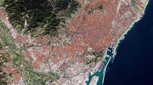
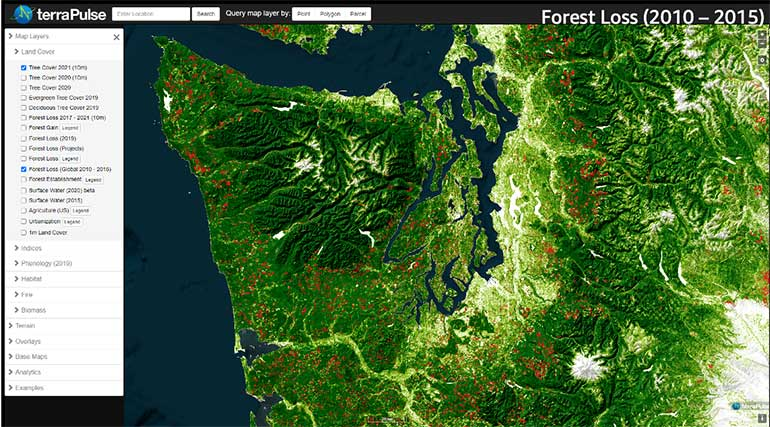
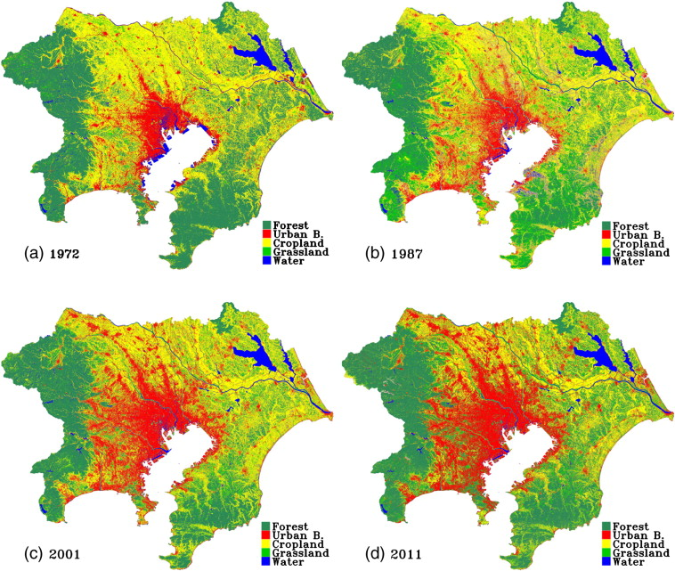

---
title: "Landsat Data"
subtitle: "Landsat sensors - Week 2"
author: "Ana Steiner"
institute: "UCL"
date: "2024/01/24 (updated: `r Sys.Date()`)"
output:
  xaringan::moon_reader:
    lib_dir: libs
    nature:
      highlightStyle: github
      highlightLines: true
      countIncrementalSlides: true 
    css: styles.css  
---

# Slide 1: Importance of Landsat data

The Landsat program, managed by NASA and the U.S. Geological Survey, is one of the longest-running enterprises for collecting satellite imagery of Earth. This program has been instrumental in providing continuous, valuable data for understanding and managing Earth's resources. 

- It has played a pivotal role in understanding our planet's dynamic change by providing critical Earth observation data. 
- The satellites have been working for more than 50 years and have contributed with essential data that showcases environmental and demographic changes.
- Data has played a key role in environmental research and policy making.

{width=30%}
---
# Slide 2: Missions and Satellites:

Each Landsat mission has a specific lifespan, with the program beginning in 1972 and continuing with the launch of Landsat 9 in 2021. This ensures a continuous data record.

Coverage frequency varies by satellite but typically includes a revisit to the same area every 16 days, which, while not as frequent as some Sentinel satellites, provides a valuable long-term record for change detection and trend analysis.

{height=10%}
---

# Slide 3: Attributes and Sensors

- The Landsat program employs Earth-observing satellites, each equipped with specialized sensors, such as the Operational Land Imager and Thermal Infrared Sensor. These sensors capture data across multiple spectral bands, offering valuable insights into Earth's surface properties.

**Spatial Resolution:** Landsat imagery offers a range of spatial resolutions, with the most recent Landsats (Landsat 7 and Landsat 8) providing resolutions from 15 meters (panchromatic band) to 30 meters (multispectral bands) for land observations. This resolution allows for detailed mapping and analysis of land cover and land use changes.

**Temporal Resolution:** Landsat satellites have a revisit cycle of 16 days, providing a balance between high spatial resolution and frequent temporal coverage. This enables consistent monitoring of changes over time, important for environmental management, agricultural assessment, and tracking urban expansion.

**Radiometric Resolution:** Landsat sensors are designed to capture a wide range of brightness levels, enhancing their ability to detect subtle changes in the Earth's surface, from dark, dense forests to bright snow-covered areas.

**Spectral Resolution:** Landsat satellites carry sensors that measure light in various wavelengths, including visible, near-infrared, and thermal infrared bands. This spectral diversity is crucial for differentiating between different types of vegetation, soil, water bodies, and man-made materials.

---

# Slide 4: Applications

Landsat satellites primarily capture optical imagery, which includes visible light, near-infrared, and short-wave infrared. This allows for detailed observations of the Earth's surface during daytime passes.

**Forest Management:** Landsat imagery supports the monitoring of forest health, coverage, and changes over time due to natural processes or human activities. It's crucial for conservation efforts, understanding the impacts of climate change, and managing resources sustainably.

**Agriculture Monitoring:** The program plays a significant role in assessing crop health, estimating yields, and managing irrigation, aiding in food security and efficient resource use.

**Urban Deformation Mapping:** Landsat's optical data can also contribute to urban planning and development studies by providing high-resolution images that help monitor growth and land-use change.

**Marine Monitoring and Emergency Management:** Landsat data can also support coastal zone management, monitoring of water quality, and assessment of marine ecosystems to some extent. In emergency management, 

---

# Slide 5: Application in Environmental Monitoring
- Below, you can see images of forest cover monitoring conducted in 2019. They show different forest management in USA, Democratic Republic of Congo and Cambodia.

---

# Slide 6: Application in Agriculture and Food Security
- The project TerraPulse has used Landsat data to identify sustainable opportunities for agriculture that does not degrade the environment and ensures food security.

{width=30%}

---

# Slide 7: Application in Urban Planning and Infrastructure

Landsat's archive facilitates urban growth analysis, land use planning, and infrastructure development. The picture showcases the rapid urbanization changes in Yokyo.

{width=20%}

---

# Slide 8: Reflections

**Limitations:**
Spatial Resolution: Landsat imagery offers a range of spatial resolutions, with the most recent Landsats (Landsat 7 and Landsat 8) providing resolutions from 15 meters (panchromatic band) to 30 meters (multispectral bands) for land observations. This resolution allows for detailed mapping and analysis of land cover and land use changes.

Temporal Resolution: Landsat satellites have a revisit cycle of 16 days, providing a balance between high spatial resolution and frequent temporal coverage. This enables consistent monitoring of changes over time, important for environmental management, agricultural assessment, and tracking urban expansion.

Radiometric Resolution: Landsat sensors are designed to capture a wide range of brightness levels, enhancing their ability to detect subtle changes in the Earth's surface, from dark, dense forests to bright snow-covered areas.

Spectral Resolution: Landsat satellites carry sensors that measure light in various wavelengths, including visible, near-infrared, and thermal infrared bands. This spectral diversity is crucial for differentiating between different types of vegetation, soil, water bodies, and man-made materials.

---

# Slide 9: Comparison with Sentinel

**Mission Scope:** Landsat is focused on long-term monitoring of Earth's land surfaces, making it invaluable for environmental research and resource management. Sentinel satellites, part of the Copernicus program, offer a broader scope, including land, ocean, ice, and atmosphere monitoring, supporting diverse applications from environmental protection to security.

**Spectral and Sensor Capabilities:** Landsat provides detailed spectral data for land analysis, including vegetation, water, and thermal properties. Sentinel encompasses a wider range of sensors, like SAR on Sentinel-1 for all-weather conditions and high-resolution multispectral instruments on Sentinel-2 for detailed vegetation and land cover studies.

**Spatial Resolution:** Landsat offers resolutions up to 15 meters for detailed land observations. Sentinel-2 provides even finer resolutions (down to 10 meters), enabling more detailed analysis of land cover and vegetation health.

**Temporal Resolution:** Landsat satellites have a 16-day revisit cycle per satellite, aiming for comprehensive coverage of Earth's landmass. Sentinel satellites, working in pairs, offer more frequent revisits (as short as 5 days for Sentinel-2), which is crucial for monitoring rapid changes and dynamic environments.

---

# Slide 10: Bibliography
https://earthobservatory.nasa.gov/images/85673/sierra-nevada-de-santa-marta
https://earthobservatory.nasa.gov/images/44102/vistula-river-flooding-southeastern-poland
https://landsat.gsfc.nasa.gov/satellites/landsat-9/
https://www.sciencedirect.com/science/article/pii/S0034425712003653
https://study.com/academy/lesson/what-is-the-landsat-program-importance-history.html
https://landsat.gsfc.nasa.gov/article/synergistic-power-landsat-gedi/
https://aws.amazon.com/es/blogs/publicsector/managing-worlds-natural-resources-earth-observation/
https://www.sciencedirect.com/science/article/pii/S0034425712003653

